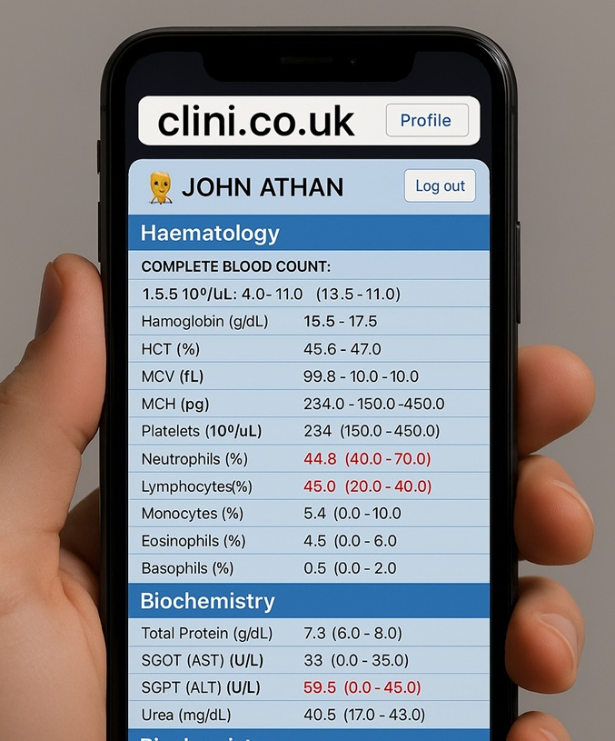
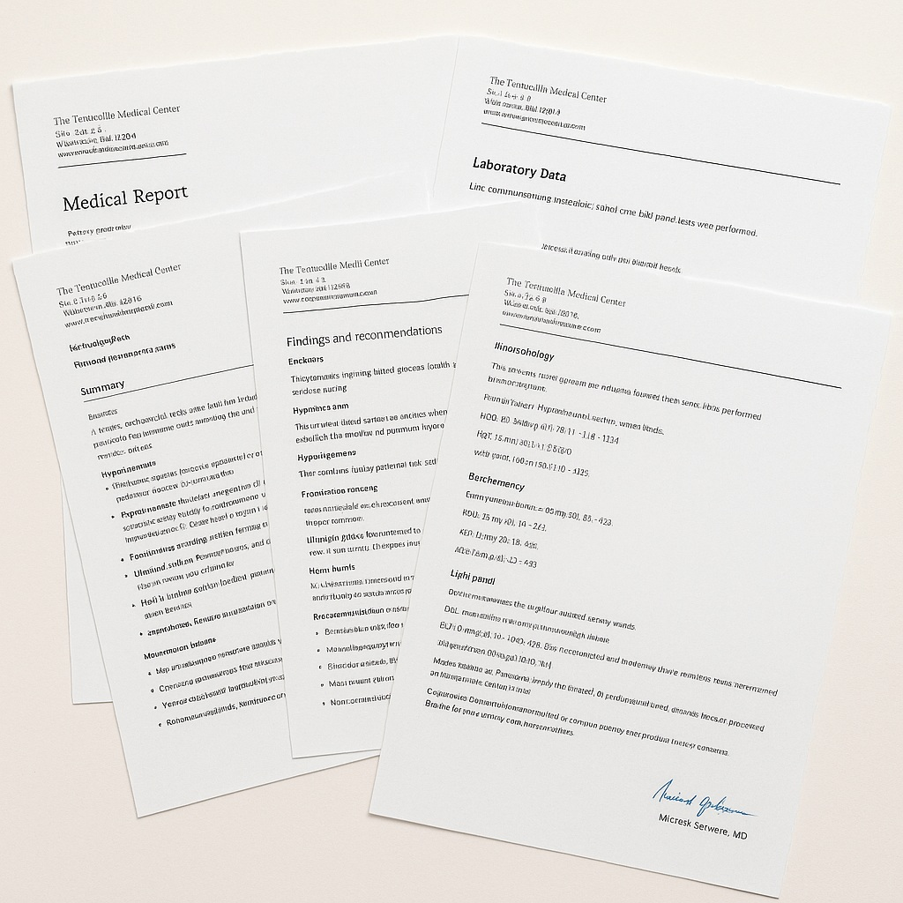

# An AI-Assisted Medical Report Generator for use in Qatar.







Live version: https://www.clini.co.uk

Youtube demo: https://youtu.be/1PT9y61OeOU


## Description

This capstone project for CS50 is a Django web application designed to streamline the extraction of medical data from uploaded clinical documents and generate patient-friendly reports using AI. It is designed for use at my workplace, a medical clinic in Doha, Qatar.

Doctors and other healthcare professionals frequently order laboratory tests such aa blood tests or xrays.

Results need to be relayed to patients in a way that is clear and easy to understand, and with interpretation and advice based on their particular issues.

This web application allows doctors to collate results and medical information generated after a patient visit, and then generate a detailed and professional report which can be shared with the patient.

## Features 

- Runs on any web-enabled device (computer, tablet, phone).
- User authentication with one-time email confirmation.
- User uploads files via drag-and-drop.
- Uploaded data is cleaned and anonymised.
- Data is encrypted using the Advanced Encryption Standard (AES), a symmetric block cipher.
- Medical data is extracted and organised.
- A Report is generated.
- The User may review, edit and download the report.
- Optional password protection of report, using Qatar National ID number or another password.


## Programming Languages

- **Backend:** Django 3.2, python
- **Frontend:** HTML, CSS, JavaScript

## Distinctiveness and Complexity

### Distinctiveness

Review of previous CS50web capstone projects does not show any similar submissions as of 2nd May 2025. Specifically, I found no projects that are web applications to allow multiple healthcare professionals working within a chain of clinics in to upload medical test results and generate reports to share with patients using an AI assistant.

This application is designed to be used in Doha, Qatar and embeds features such as password-protection using a patient's National Qatar Identification Number, and identifitcation of test reports from specific laboratories in Doha.

### Complexity

This is a complex project. It involved the creation of four inter-connected django apps holding multiple template and styling files, communication from back- and front-end via JSON files, an interactive user interface, and the use of a SQLite3 database.

It also required study beyond the CS50web course, to include security consdierations like anonymisation and encryption of senistive data, SMTP email user authetication, and OpenAI API calls to parse medical data and generate a final report.


## Project structure

This Django Project  is organised into 4 apps. Please click the app titles below for an explanation, and to expand a list of all files to which I have contributed code.

<details>
  <summary>Core</summary>

  ## core app
  Within the core app, the user interface is structured as a single-page web application, with html components dynamically controlled using javascript modules and CSS. The core app also contains any functions that are called by other apps.

  `views.py` contains the routes for displaying the main single-page html template, as well as "privacy" and "about" templates.

  `utils.py` contains helper functions which are called by other mutliple apps, such as encryption of files and text

  The folder `templates\core` contains the main single-page html template which is `report_builder.html`. There are also templates for describing the application and the privacy features here. All templates extend a common `layout.html` base template.
  
  The `report_builder.html` template is controlled dynamically using javascript within the other apps of this project, to display content appropriate to the stage of the report generation (user authentication -> upload files -> manage patients -> extract data -> review and download report)

  The folder `static\core` contains a a javascript file `static\core\js\main.js` which initialises the singlepage template. `static\core\images` contains image files for use in th e templates, and `static\core\styles.css` contains css styling for use throughout the project, to give each section a consistent appearance.


</details>

<details>
  <summary>User</summary>

  ## user app
  The user app is a seperate app for user authentication, including registration, login, change user profile and password, and SMTP email verification of the user's identity.

  Because all local users at the clinic in Qatar are expected to have an organisation-specific email, this ensures that any visitors from outside the clinic can use the generic parts of the application but not the organisation-specific parts of the application such as propriertary letterheads and stamps.

  The `Userprofile` model extends Django's standard `User` model. `signals.py` contains a django signal to create a new `Userprofile` object when a new `User` object is created.
  
  `tokens.py` makes a hash from timestamp and user info, for encryption purposes
  
  `views.py` Defines views that handle the user authenticaion HTTP requests and return responses  

  The folder `templates\user` contains the html templates which are used for user management. These extent the `layout.html` template in the core app.

</details>


<details>
  <summary>Upload</summary>
  
  ## upload app
  Within the upload app, files can be dragged and dropped into a window on the web page for uploading to the server. They are encrypted before being stored in a filesystem and referenced in the database. The decrypt key is specific to each user, ensuring that there can be no breach of privacy. One user cannot access files uploaded by another user.

  The javascript at `upload\static\upload\js\upload.js` hanldes the drag and drop functionality, and the javascript at `upload\static\upload\js\patient.js` allows manual organisation of the files and creation of new patient objects using a graphical user interface.

  the folder `upload\services` contains several python files which deal with the uploading and organisation of data:
  
  `upload_pipeline.py` co-ordinates the flow through the upload extraction, file assignment and storage processes.

  `find_name_in_pdf.py` is a function to try to find the patient's name in the text of an uploaded file.

  `extract_text_from_pdf.py` is afunction to read the text of a pdf file using PyPDF2 library
  
  `jpg_to_pdf_bytes.py` takes as input a jpg image and stores it a single pdf file for incorporation into report later, and for encyrpting and storing in the filesystem.

  `txt_to_pdf_bytes.py` takes as input a txt file and stores it a single pdf file for incorporation into report later, and for encyrpting and storing in the filesystem.

  The folder `upload/services/doha/` contains python files with functions to extract data from pdf files which are specific to Doha Qatar. It keeps this logic seperate from the logic for more general data extraction.
  
  `find_name_in_doha_pdf` is a function to find a patient's name from a text input, using regular expressions. `find_qid_in_doha_pdf` is function to find a patient's nationa ID number from a text input, using regular expressions. This is used as a password for the final report.
  `identify_doha_pdf.py` returns the name of the lab or source which generated the pdf, if it is possible to do so.

</details>

<details>
  <summary>Reportgen</summary>

  ## reportgen app
  
  Within the reportgen app, plain text is extracted from the PDF files, and then anonymised. Using an AI API call, medical data is parsed from this anonymised text. This data is cleaned and organised, and passed to the AI API again, with prompts to generate a report.

  The javascript which modifies the main HTML template is contained in two files: `reportgen\static\reportgen\js\attributes.js` displays extracted medical data, and allows ,manual editing oof this data; `reportgen\static\reportgen\js\report.js` displays the generated report, allows manuale editing of the report, and displays buttons to preview or download the final report.

  The folder `reportgen/services` contains python functions for data extraction and report generation.

  `extract_data_pipeline.py` is the function which manages the steps to extract, anonymise, redact and structure medical data from the uploaded pdf files.

  `extract_text_from_pdfupload_object.py` takes a PDFUpload instance, decrypts the encrypted file, and extracts its text using PyPDF2.

  `anonymiser.py` contains functions to anonymise and redact text from the uploaded pdf files, using the `spacy` library. For data privacy and security, all data is anonymised before being shared with any third party via an API call (the OpenAI API)

  `extract_data_AI` is a function to extract and organise medical data from redacted text, using an OpenAI API call. It returns the data organised within a JSON object.

  `process_data` contains functions which format the data into a list of strings which can be displayed in the attriutes window of the main html template , manipulated via attributes.js

  `generate_report_AI` contains functions to generate a report from the organised medical data, using an OpenAI API call. It returns a string of text.
  
  `write_pdf_report.py` contains functions to build a professional-quality PDF document from the generated text

</details>


## Setup Instructions

Please expand the steps below for detailed setup instructions

<details>
  <summary>Clone the repo</summary>

```bash
git clone https://github.com/me50/nyberry/web50/projects/2020/x/capstone/clini.git
cd clini
```
</details>

<details>
<summary>Create and activate virtual environment, install dependencies</summary>

### Create venv, install dependencies

Create and activate virtual environment, and install dependencies by running the following commands:

```bash
python -m venv venv
venv\Scripts\activate  # On Windows
source venv/bin/activate  # On macOS/Linux
pip install -r requirements.txt
```

Then, in the project's root directory (the same directory as manage.py) create a `.env` file containing your personal secret keys for:
- django
- your SMPT email host
- Open AI API

example `.env` file:
```env
SECRET_KEY=your-django-secret-key
EMAIL_HOST_PASSWORD=your-email-password
OPENAI_API_KEY=your-openai-key
```
</details>


<details>
<summary>Apply migrations</summary>

Apply migrations to initialise the database
```bash
python manage.py migrate
```
</details>

<details>
<summary>Run the development server</summary>

### Start the development server:

```bash
python manage.py runserver
```
Then visit `http://127.0.0.1:8000` in your browser to use a local instance of the application
</details>

<details>
<summary>Deployment Notes</summary>

### Deployment notes (using PythonAnywhere)
In production:
- Set `DEBUG = False` in `settings.py`
- Run `python manage.py collectstatic`
- Map `/static/` and `/media/` directories in PythonAnywhere's Web tab:
  - `/static/` → `/home/yourusername/clini/staticfiles/`
  - `/media/` → `/home/yourusername/clini/media/`
</details>


## License

Copyright (c) 2025 clini.co.uk

Permission is hereby granted to any person obtaining a copy of this software and associated documentation files (the "Software"), to use the Software subject to the following conditions:

1. The above copyright notice and this permission notice shall be included in all copies or substantial portions of the Software.

2. The software is provided without warranty of any kind, express or implied, including but not limited to the warranties of merchantability, fitness for a particular purpose and noninfringement. In no event shall the authors or copyright holders be liable for any claim, damages or other liability, whether in an action of contract, tort or otherwise, arising from, out of or in connection with the software or the use or other dealings in the software.
